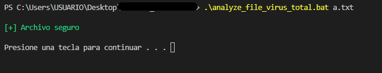
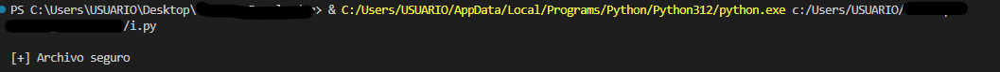
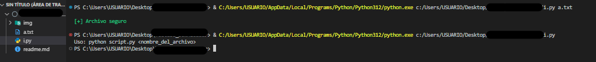

# 🔍 Analyze File with VirusTotal


---

---

---



¡Bienvenido a **Analyze File with VirusTotal**! 🛡️ Este script es tu compañero ideal para analizar archivos y asegurarte de que están libres de amenazas utilizando la API de VirusTotal.

## 🚀 ¿Qué Hace?

Este script analiza un archivo que tú elijas con la API de VirusTotal y te dice si es seguro o malicioso. Si el archivo es peligroso, ¡lo elimina automáticamente! 🗑️

## 🛠️ Requisitos

- **Python 3.6+** 🐍
- **Librerías necesarias** (puedes instalarlas con pip):
  - `virus_total_apis`
  - `hashlib`

## ⚙️ Instalación

1. **Clona el repositorio** (si aún no lo tienes):

    ```bash
    git clone https://github.com/tu_usuario/analyze_file_virus_total.git
    ```

2. **Instala la librería `virus_total_apis`**:

    ```bash
    pip install virus_total_apis
    ```

3. **Configura tu clave API de VirusTotal**:

    Regístrate en [VirusTotal](https://www.virustotal.com) y obtén tu clave API. Luego, abre `analyze_file_virus_total.py` y añade tu clave API en la siguiente línea:

    ```python
    api_key = "tu_clave_api_de_virustotal"
    ```

## 🏃‍♂️ Cómo Usarlo

### 1. Analizar un archivo

Corre el script pasando el nombre del archivo que quieres analizar (que este en el mismo repositorio ):

```bash
python analyze_file_virus_total.py archivo_a_analizar.exe
```
o pruebe otra forma con el archivo bat
```bash 
analyze_file_virus_total.bat archivo_a_analizar.exe
```